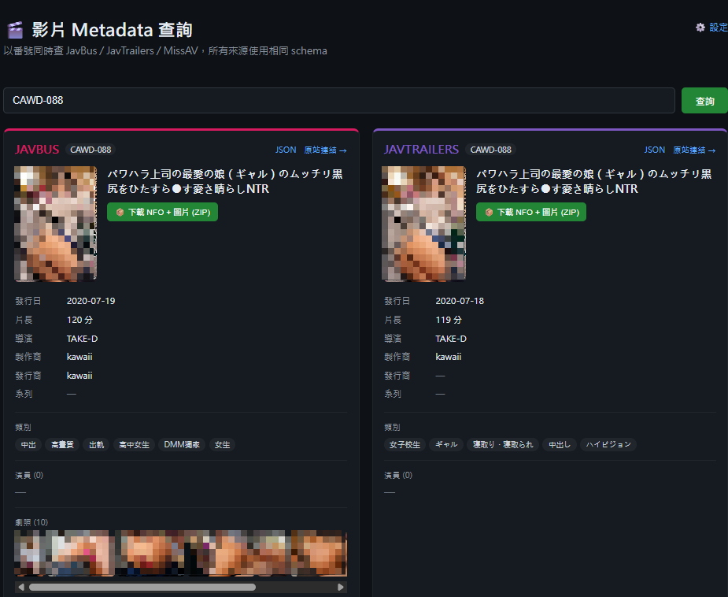
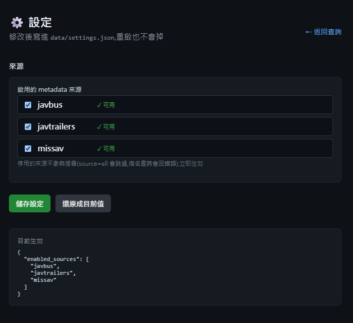
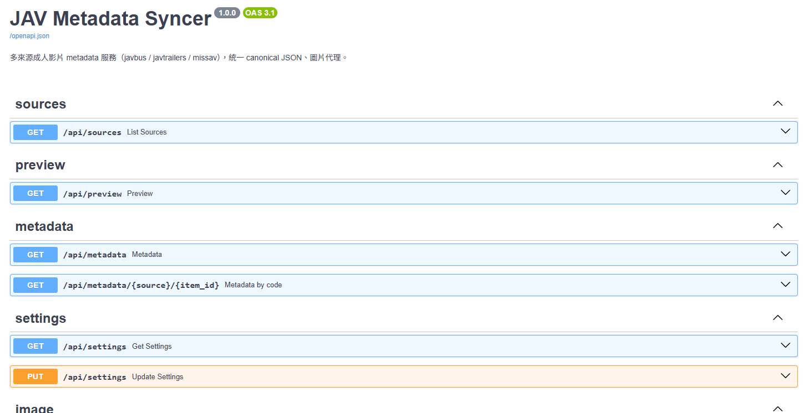

# JAV Metadata Syncer

多來源日本成人影片（JAV）metadata 服務：以**番號**（如 `SSIS-001`）一次查詢
**JavBus / JavTrailers / MissAV** 三個來源，以**統一 canonical JSON** 格式提供 REST API，
並內建**圖片代理**（繞過來源站防盜連 + DVD 封面自動裁切）與深色主題網頁介面。

本專案與姊妹作使用完全相同的架構與 API 形狀，client 可以用同一套整合程式碼接三個服務：


| 專案                                                                         | 領域        | 來源                        |
| -------------------------------------------------------------------------- | --------- | ------------------------- |
| [comic-metadata-syncer](https://github.com/acer1204/comic-metadata-syncer) | 漫畫        | Bangumi、AniList           |
| [show-metadata-syncer](https://github.com/acer1204/show-metadata-syncer)   | 電視節目 / 電影 | TheTVDB、TMDB              |
| **jav-metadata-syncer**（本專案）                                               | 成人影片      | JavBus、JavTrailers、MissAV |


## 預覽


| 查詢主畫面（多來源比對）                     | 設定                                 | API 文件（/docs）                  |
| -------------------------------- | ---------------------------------- | ------------------------------ |
|  |  |  |


## 特色

- **番號一次查三來源**：並行查詢，各來源回傳同形狀的 canonical JSON，可互相比對補全
- **不需任何 API key**：三個來源都是直接爬取；MissAV / JavTrailers 在 Cloudflare 後面，已用 `curl_cffi` 模擬瀏覽器 TLS 指紋處理
- **圖片代理**：來源站的封面 / 劇照有 Referer 防盜連，`/api/image` 會帶正確的 Referer；`crop=cover` 可把 DVD 封面橫向合圖（背面+正面）自動裁出右半的正面
- **Emby / Jellyfin NFO 輸出**：一鍵輸出電影資料夾（`movie.nfo` + 裁切後 `poster.jpg` + `fanart.jpg` + `extrafanart/` 劇照）到 `output/`
- **來源啟用開關**：設定頁可個別停用來源，立即生效並持久化
- **30 分鐘查詢快取**：同番號重複查詢（含 preview → metadata 接續呼叫）不會重抓來源站
- **統一 API 家族**：`/api/preview`、`/api/metadata`、`/api/sources`、`/api/settings` 與姊妹作完全同形


## 專案結構

```
backend/
  app/
    main.py              # FastAPI 入口（CORS / utf-8 charset / 靜態前端）
    config.py            # env 設定 (pydantic-settings)
    runtime_settings.py  # UI 設定持久化 (data/settings.json)
    api/
      preview.py         #   GET /api/preview        快速候選
      metadata.py        #   GET /api/metadata       canonical JSON（多來源）
      sources.py         #   GET /api/sources        來源清單與狀態
      settings.py        #   GET/PUT /api/settings   執行期設定
      image.py           #   GET /api/image          圖片代理
      export.py          #   POST /api/nfo/movie + /api/export  NFO 輸出
    nfo.py               # movie.nfo XML 產生 + 檔案輸出
    sources/
      base.py            # canonical schema 定義 + Movie→canonical 轉換
      __init__.py        # SOURCES registry + 30 分鐘快取 ← 新來源在這裡註冊
    clients/
      base.py            # BaseProvider / Movie / Actress dataclasses
      javbus.py          # JavBus 爬蟲（httpx）
      javtrailers.py     # JavTrailers 爬蟲（curl_cffi，Cloudflare）
      missav.py          # MissAV 爬蟲（curl_cffi，Cloudflare）
frontend/                # React + Vite 深色主題（查詢 / 設定 兩頁）
main.py                  # CLI：py main.py SSIS-001 [--provider missav]
```


## 快速開始


### Docker（建議）

```bash
docker compose up -d --build
```

開 [http://localhost:7712](http://localhost:7712) 。`./data` 是設定持久化、`./output` 是 NFO 輸出目錄。

### 本機開發

```bash
# 後端 (port 7712)
cd backend
pip install -r requirements.txt
py -m uvicorn app.main:app --port 7712 --reload

# 前端 (port 5175，/api 自動 proxy 到 7712)
cd frontend
npm install
npm run dev
```


### CLI

```bash
py main.py SSIS-001                       # 預設查 javbus，輸出 JSON[內碼] 
py main.py CAWD-088 --provider missav     # 指定來源
```


## API 說明

互動式文件（Swagger）：[http://localhost:7712/docs](http://localhost:7712/docs)

### `GET /api/sources` — 來源清單與狀態

```json
[
  {"name": "javbus",      "enabled": true, "ready": true, "requires_key": false, "nfo_crawl": false},
  {"name": "javtrailers", "enabled": true, "ready": true, "requires_key": false, "nfo_crawl": false},
  {"name": "missav",      "enabled": true, "ready": true, "requires_key": false, "nfo_crawl": false}
]
```

client 建議先打這支決定要查哪些來源。停用的來源（`enabled: false`）在
`source=all` 搜尋時被跳過，指名查詢會回 `400`。

### `GET /api/preview?q=SSIS-001&source=all` — 快速候選

番號是精確比對，每個來源最多回 1 筆（命中 `score` 固定 100）。
每筆 12 個欄位，與姊妹作的 preview **完全同形**：

```json
{
  "source": "javbus",
  "id": "SSIS-001",
  "title_cn": "",
  "title_native": "一ヶ月間の禁欲の果てに…",
  "title_english": "",
  "year": "2021",
  "url": "https://www.javbus.com/SSIS-001",
  "cover": "https://www.javbus.com/pics/cover/xxxx.jpg",
  "score": 100.0,
  "overview": "…",
  "aliases": [],
  "hint": ""
}
```


### `GET /api/metadata?q=SSIS-001&source=all` — 完整 canonical JSON

```json
{
  "query": "SSIS-001",
  "sources": [
    {
      "source": "javbus",
      "id": "SSIS-001",
      "url": "https://www.javbus.com/SSIS-001",
      "match_score": 100,
      "media_type": "movie",
      "code": "SSIS-001",
      "title": "一ヶ月間の禁欲の果てに…",
      "plot": "",
      "year": "2021",
      "premiered": "2021-02-18",
      "runtime": "150",
      "studio": "エスワン ナンバーワンスタイル",
      "label": "S1 NO.1 STYLE",
      "series": "",
      "directors": [{"name": "苺原"}],
      "actors": [{"name": "葵つかさ", "role": "", "type": "Actress", "thumb": "https://…"}],
      "genres": ["美少女", "…"],
      "unique_ids": {"code": "SSIS-001"},
      "images": {"poster": "https://…", "fanart": "", "thumb": "https://…"},
      "sample_images": ["https://…"]
    }
  ]
}
```

查無結果的來源仍會回一筆空 entry（`id` 為空字串），讓 client 知道該來源查過了。

### `GET /api/metadata/{source}/{code}` — 按來源直取單筆

```bash
curl "http://localhost:7712/api/metadata/javbus/SSIS-001"
```

回傳單一 canonical 物件（無 `sources` 包裝）；找不到回 `404`。

### `GET /api/image?url=…&crop=cover` — 圖片代理

來源站的圖片有 Referer 防盜連，**不能直接 hotlink**，一律走這支代理：

```
/api/image?url=https%3A%2F%2Fwww.javbus.com%2Fpics%2Fcover%2Fxxxx.jpg&crop=cover
```

- 依 host 白名單帶上正確的 Referer（javbus / dmm / fourhoi / javtrailers 等）
- `crop=cover`：偵測到寬高比 > 1.4 的 DVD 合圖時，自動裁出右半的正面封面
- 回應帶 `Cache-Control: public, max-age=86400`


### `POST /api/nfo/movie` — 產生 movie.nfo XML（不寫檔）

```bash
curl -X POST http://localhost:7712/api/nfo/movie \
  -H "Content-Type: application/json" \
  -d '{"source": "javbus", "code": "SSIS-001"}'
```


### `GET /api/export.zip?source=&code=` — 打包 ZIP 下載

網頁上每張來源卡片的「📦 下載 NFO + 圖片 (ZIP)」按鈕就是打這支。
ZIP 內是一層 `{CODE}/` 資料夾，解壓即為 Emby 電影資料夾。

```bash
curl -OJ "http://localhost:7712/api/export.zip?source=javbus&code=SSIS-001"
```


### `POST /api/export` — 輸出到伺服器端 output/

同一套檔案改為直接寫到伺服器的 `output/{CODE}/`（Docker 掛載 `./output`），
適合服務跟媒體庫在同一台機器的情境。

```bash
curl -X POST http://localhost:7712/api/export \
  -H "Content-Type: application/json" \
  -d '{"source": "javbus", "code": "SSIS-001"}'
```

輸出結構（Emby / Jellyfin 電影慣例，一部片一個資料夾）：

```
output/SSIS-001/
├── movie.nfo             # 標題(帶番號前綴)/劇情/導演/片商/系列(set)/類別/演員/uniqueid
├── poster.jpg            # 裁切後的正面封面
├── fanart.jpg            # 完整封面
└── extrafanart/          # 劇照（JavBus 來源才有）
    ├── fanart1.jpg ...
```

同步執行（單片幾秒內完成），回傳 `{ok, output, files}`。同番號重複輸出會覆寫，以最後一次選的來源為準。

### `GET / PUT /api/settings` — 執行期設定

```bash
curl "http://localhost:7712/api/settings"
# {"enabled_sources": ["javbus", "javtrailers", "missav"]}

curl -X PUT http://localhost:7712/api/settings \
  -H "Content-Type: application/json" \
  -d '{"enabled_sources": ["javbus", "missav"]}'
```

部分更新（只送要改的欄位），寫入 `data/settings.json`，重啟不會掉、改完立即生效。

## client 典型流程

```
1. GET /api/sources                    → 拿來源清單，只查 enabled 的
2. GET /api/metadata?q=SSIS-001        → 各來源 canonical detail，自行挑選或合併
3. 所有圖片 URL 一律包成 /api/image?url=…（防盜連）
```


## 新增來源

1. 在 `backend/app/clients/` 加一個 provider：
  ```python
   from .base import BaseProvider, Movie, Actress, NotFoundError

   class MyProvider(BaseProvider):
       name = "myprovider"
       base_url = "https://example.com"

       async def search(self, code: str) -> Movie:
           ...
           return Movie(provider=self.name, code=code, title=..., ...)
  ```
2. 在 `backend/app/clients/__init__.py` 的 `PROVIDERS` 註冊
3. 在 `backend/app/sources/__init__.py` 的 `_PROVIDERS` 加上它
4. 若圖片來自新 CDN，把 host + Referer 加進 `backend/app/api/image.py` 的 `_REFERER_BY_HOST`

`/api/sources`、`/api/preview`、`/api/metadata` 與前端會自動涵蓋新來源。

## 已知注意事項

- **MissAV / JavTrailers 較慢**（2–4 秒）：Cloudflare 驗證的往返成本，屬正常現象
- **JavBus 需要** `existmag=all` **cookie**（已內建），否則資訊區塊會是空的
- **部分番號沒有演員資訊**：來源頁面本身就沒有，回空陣列是正確行為
- **MissAV 的劇照是 JS 動態載入**，不在爬取範圍（`sample_images` 為空）
- Windows 主控台預設 cp950 印不出日文，CLI 已自動切 UTF-8；用 PowerShell 呼叫 API 沒問題（回應已帶 `charset=utf-8`）


## 免責聲明

本工具僅供**個人媒體庫整理**用途，metadata 版權屬原網站所有。請遵守當地法律與來源網站的使用條款。