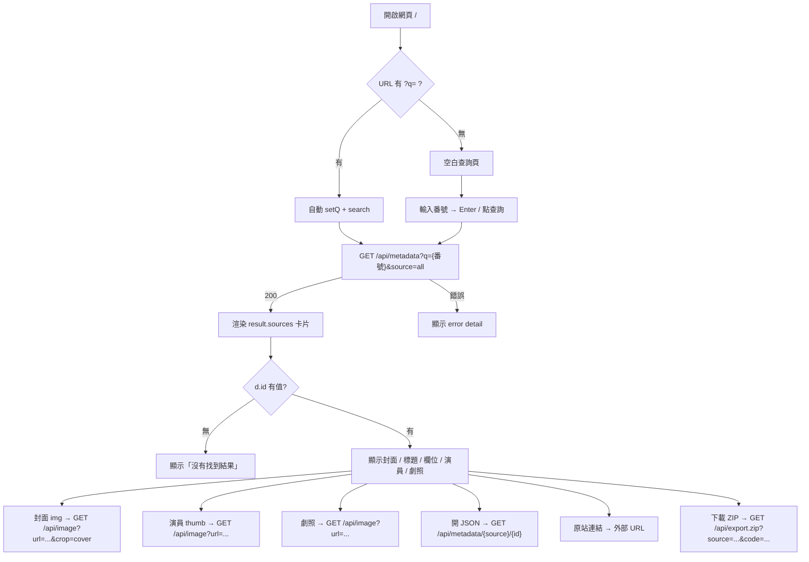
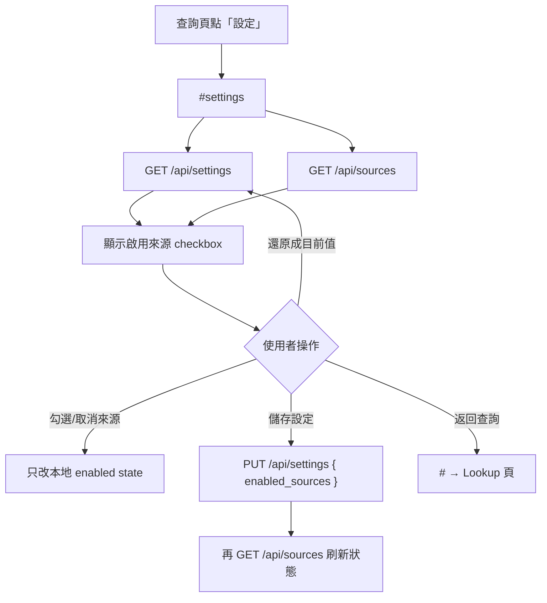

把流程補上每個步驟實際呼叫的 API：

## 主流程：查詢 → 比對 → 匯出




| 步驟  | 使用者動作      | API                                   | 前端呼叫                          |
| --- | ---------- | ------------------------------------- | ----------------------------- |
| 1   | 輸入番號查詢     | `GET /api/metadata?q=…&source=all`    | `Api.metadata(term)`          |
| 2a  | 顯示封面       | `GET /api/image?url=…&crop=cover`     | `proxyImage(poster, "cover")` |
| 2b  | 顯示演員圖 / 劇照 | `GET /api/image?url=…`                | `proxyImage(…)`               |
| 3   | 開 raw JSON | `GET /api/metadata/{source}/{id}`     | 直接 `<a href>`                 |
| 4   | 下載 NFO ZIP | `GET /api/export.zip?source=…&code=…` | `Api.exportZip(source, code)` |


---


## 設定流程




| 步驟  | 使用者動作  | API                                             | 前端呼叫                        |
| --- | ------ | ----------------------------------------------- | --------------------------- |
| 1   | 進入設定頁  | `GET /api/settings`                             | `Api.getSettings()`         |
| 2   | 載入來源清單 | `GET /api/sources`                              | `Api.sources()`             |
| 3   | 儲存     | `PUT /api/settings` body: `{ enabled_sources }` | `Api.updateSettings(patch)` |
| 4   | 儲存後刷新  | `GET /api/sources`                              | `Api.sources()`             |
| 5   | 還原     | 再打 1+2                                          | `reload()`                  |


---


## 端到端一覽（依使用順序）

```
[查詢頁]
  輸入番號
    └─ GET  /api/metadata?q=SSIS-001&source=all
         └─ 卡片渲染時（瀏覽器自動請求）
              ├─ GET /api/image?url=…&crop=cover   ← 封面
              ├─ GET /api/image?url=…              ← 演員 / 劇照
              ├─ GET /api/metadata/{source}/{id}   ← 點「JSON」
              └─ GET /api/export.zip?source=…&code=… ← 點「下載 NFO」

[設定頁]
  進入
    ├─ GET  /api/settings
    └─ GET  /api/sources
  儲存
    ├─ PUT  /api/settings
    └─ GET  /api/sources   ← 再刷一次
```

---


## 前端有定義但 UI 沒用到


| API                | Client 方法         | 說明                |
| ------------------ | ----------------- | ----------------- |
| `GET /api/health`  | `Api.health`      | 未呼叫               |
| `GET /api/preview` | `Api.preview`     | 未呼叫（無預覽選角步驟）      |
| `POST /api/export` | `Api.exportMovie` | 未呼叫（UI 只用 ZIP 下載） |


